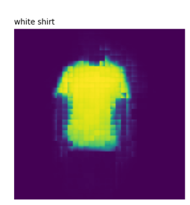
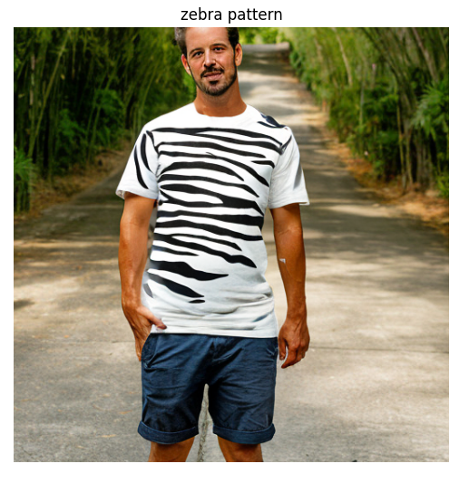
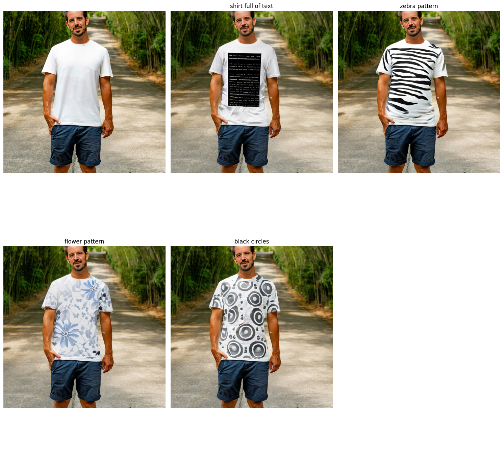

# Prompt-Based Generative Cloth Editing  
### CLIPSeg + Stable Diffusion Inpainting
[](https://www.python.org/)  
[](https://github.com/shivasamkumar/Prompt_Based_Cloth_editting/blob/main/Prompt_based_Genrative_cloth_editting.ipynb)  
[](LICENSE)

https://github.com/shivasamkumar/Prompt_Based_Cloth_editting/blob/main/Prompt_based_Genrative_cloth_editting.ipynb

Turn *any* garment photo into a canvas for rapid, prompt-driven design exploration.  
This Colab/Notebook pipeline combines **CLIPSeg** for free-form semantic masking with **Stable Diffusion** inpainting to generate realistic cloth variations from natural-language prompts.

---

## Key Features
- **Prompt-guided semantic masks** &nbsp;– Type *“sleeves”* or *“collar”* and CLIPSeg returns a pixel-accurate mask.  
- **One-click inpainting** &nbsp;– Feed the masked region plus a textual style prompt to Stable Diffusion.  
- **Batch mode** &nbsp;– Generate multiple design variants in a loop; results saved under `outputs/`.  
- **Colab ready** &nbsp;– Notebook auto-installs CLIP, CLIPSeg, Diffusers, and dependencies.  
- **Modular** &nbsp;– Swap in other segmenters or diffusion checkpoints with two lines of code.

---

## Demo
| Original | Mask ( “sleeves” ) | Prompt → Result |
|----------|-------------------|-----------------|
|  |  | “Zebra pattern” →  |


<p align="center">
  
</p>


---

## Quick Start

### ▶ Open in Colab

### 🖥️ Run Locally
```bash
git clone https://github.com/<your-user>/<your-repo>.git
cd <your-repo>

# 1- Create a fresh env (optional)
python -m venv venv && source venv/bin/activate

# 2- Install deps
pip install torch --index-url https://download.pytorch.org/whl/cu121    # pick your CUDA
git clone https://github.com/timojl/clipseg.git && pip install -e clipseg
pip install git+https://github.com/openai/CLIP.git
```
---
## 📖 Citation

```bibtex
@InProceedings{lueddecke22_cvpr,
    author    = {L\"uddecke, Timo and Ecker, Alexander},
    title     = {Image Segmentation Using Text and Image Prompts},
    booktitle = {Proceedings of the IEEE/CVF Conference on Computer Vision and Pattern Recognition (CVPR)},
    month     = {June},
    year      = {2022},
    pages     = {7086-7096}
}

